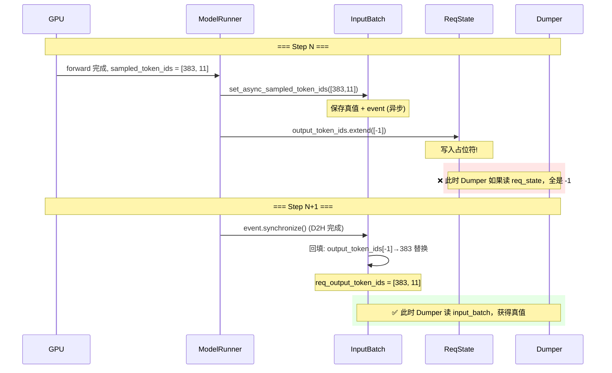
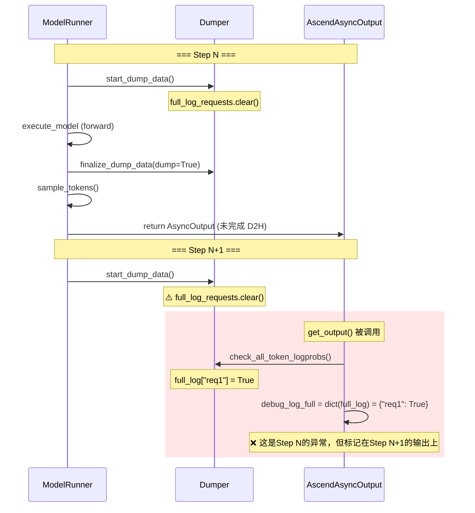
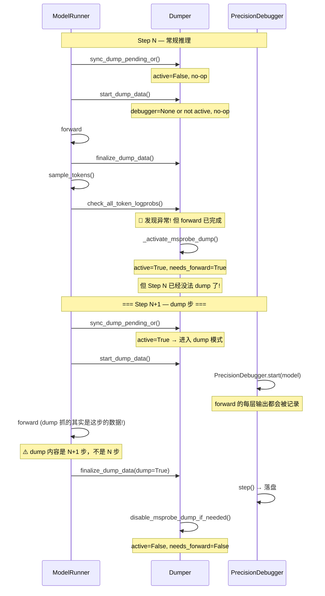
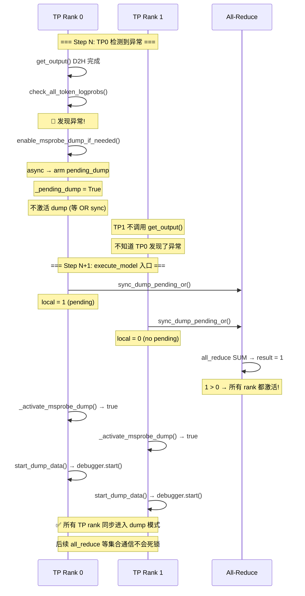

# vLLM-Ascend 异步调度下的 Dumper 问题分析

> 整理时间：2026-07-25；路径随 DFX 拆分更新：2026-07-28  
> 涉及模块：`vllm_ascend/dfx/dumper.py`（兼容 `vllm_ascend/dumper.py`）、`vllm_ascend/dfx/detector/`、`vllm_ascend/worker/v2/model_runner.py`、`vllm_ascend/worker/model_runner_v1.py`  
> DFX 总览：[dfx_design.md](./dfx_design.md)

---

## 目录

1. [核心问题概览](#1-核心问题概览)
2. [背景：同步 vs 异步调度模型](#2-背景同步-vs-异步调度模型)
3. [问题一：sampled_token_ids=-1 占位符](#3-问题一sampled_token_ids-1-占位符)
4. [问题二：debug_log_full 时序错乱](#4-问题二debug_log_full-时序错乱)
5. [问题三：Dumper start/finalize 的"下步生效"机制](#5-问题三dumper-startfinalize-的下步生效机制)
6. [问题四：异步模式下 TP 跨 Rank Dump 对齐](#6-问题四异步模式下-tp-跨-rank-dump-对齐)
7. [解决方案总结](#7-解决方案总结)

---

## 1. 核心问题概览

| 问题 | 现象 | 根因 | 影响范围 |
|------|------|------|----------|
| -1 token | `sampled_token_ids=[-1,-1,-1]` | async 下先写占位符，D2H 回填滞后 | v1/v2 |
| debug_log_full 时序 | dump 抓不到异常步的数据 | 检查时机在本步 forward 后，标记下步才生效 | v2 async |
| 下步生效 | 触发 dump 后抓不到当前步 | token_logprob 异常在 `get_output()` 检测，只能 arming 下一步 | v2 async |
| TP 跨 Rank 对齐 | 部分 TP rank 没 dump | async 下只有 TP0 触发检测，需 OR 广播 | v2 async |

---

## 2. 背景：同步 vs 异步调度模型

### 2.1 同步调度

```
┌─────────────────────────────────────────────────────────────┐
│ Step N                                                       │
│                                                              │
│  execute_model() ──► forward ──► sample_tokens()             │
│       │                              │                       │
│  start_dump_data()           finalize_dump_data()            │
│                                     │                       │
│                              D2H 同步完成                     │
│                              logprobs 已就绪                  │
│                              check_all_token_logprobs() ✓    │
│                              debug_log_full = snapshot ✓     │
└─────────────────────────────────────────────────────────────┘
```

同步路径下，`sample_tokens()` 调用 `get_output()` 后数据已全部就绪，dumper 可以在同一 step 内完成检测→打标记→dump。

### 2.2 异步调度

```
┌─────────────────────────────────────────────────────────────┐
│ Step N                                                       │
│                                                              │
│  execute_model() ──► forward ──► sample_tokens()             │
│       │                              │                       │
│  start_dump_data()           AsyncOutput (未 D2H!)           │
│                                      │                       │
│ finalize_dump_data()  ←────────── get_output() 未调用        │
│      (dump=False,                              │             │
│       占位消费被跳过)                  logprobs 还在 GPU        │
│                                                              │
│ ═══════════════════ 时间线重叠 ═══════════════════            │
│                                                              │
│ Step N+1                                                     │
│                                                              │
│  sync_dump_pending_or()  ← 真正 D2H 完成                  │
│         │                         │                          │
│    OR pending_dump          check_all_token_logprobs() ✓     │
│         │                   debug_log_full 快照 ✓            │
│    start_dump_data()                                          │
│         │                                                     │
│    forward (dump 抓取 Step N 的异常!)                         │
└─────────────────────────────────────────────────────────────┘
```

关键在于：异步路径下，**数据检测**和**数据产出**分离——检测发生在下一步，dump 抓取的也是下一步的 forward。

---

## 3. 问题一：sampled_token_ids=-1 占位符

### 3.1 根因

在 async scheduling 路径下，`_bookkeeping_sync` 先写入占位符 `[-1]`：

**v1 关键代码** (`model_runner_v1.py:2849`)：
```python
if self.use_async_scheduling:
    sampled_ids = [-1] if req_idx not in invalid_req_indices_set else None
    # ...
    req_state.output_token_ids.extend(sampled_ids)  # L2873 写入占位符
```

**v2 上游** (`vllm/v1/worker/gpu/input_batch.py`)：
```python
def set_async_sampled_token_ids(...):
    # 只有上一轮 sampling_metadata.output_token_ids 非空时才保存 CPU 侧真值
    # 否则占位符 [-1] 不会被回填
```

### 3.2 真值回填链路

```
vllm gpu_input_batch.set_async_sampled_token_ids()
    │
    ├── 保存 sampled_token_ids_cpu (真值)
    ├── 记录 event 信号
    │
    └── input_batch.req_output_token_ids[req_idx]
            │
            └── 异步修正: 将占位符 [-1] 替换为真实 token
```

**问题**：真值回填只覆盖 `sampling_metadata.output_token_ids`，**不覆盖 `req_state.output_token_ids`**。所以从 `req_state` 读取的 `output_token_ids` 永远全是 `-1`。

### 3.3 对 Dumper 的影响

```python
# dumper.py check_spec_acceptance_anomaly()
req_output_token_ids = getattr(self.runner.input_batch, "req_output_token_ids", None)
# ✅ 这里读的是 input_batch，已经被异步修正
output_token_ids_raw = req_output_token_ids[req_idx]  # 真实值

# 但如果退化到 req_state:
output_token_ids_raw = getattr(req_state, "output_token_ids", None)
# ❌ 这读到的全是 -1！
```

### 3.4 时序图



---

## 4. 问题二：debug_log_full 时序错乱

### 4.1 问题描述

`debug_log_full` 是一个 dict，记录本步哪些请求应输出完整日志。在异步模式下，该字段的写入时机和处理时机不在同一步。

### 4.2 关键代码

**同步路径** (`model_runner.py v2:_attach_observability_fields`)：
```python
if isinstance(output, ModelRunnerOutput):
    model_runner_output.debug_log_full = dict(
        self.dumper.full_log_requests_this_step
    )
```
同步下直接在返回前快照，时机正确。

**异步路径** (`AscendAsyncOutput.get_output()`)：
```python
def get_output(self) -> ModelRunnerOutput:
    output = self._inner.get_output()      # D2H 等待
    # 先检测，检测过程中可能写 full_log_requests_this_step
    self._dumper.check_all_token_logprobs(...)
    # 再快照——必须在 start_dump_data() 清空前完成
    output.debug_log_full = dict(self._dumper.full_log_requests_this_step)
    return output
```

### 4.3 并发风险

`get_output()` 可能在下一个 step 的 `start_dump_data()` 之后才被调用。而 `start_dump_data()` 第一行就是：

```python
def start_dump_data(self) -> None:
    self.full_log_requests_this_step.clear()  # ← 清空!
```

**时序冲突**：

```
Thread A (next step)          Thread B (get_output)
    │                              │
start_dump_data()                  │
full_log_requests.clear()  ❌     │
    │                      │      │
    │                      │  check_all_token_logprobs()
    │                      │  full_log_requests["req1"] = True
    │                      │
    │                      │  debug_log_full = dict(full_log)  → {"req1": True}
    │                              │
    ▼                              ▼
```

这里有竞态：如果 `clear()` 发生在 `check` 之后、`dict()` 之前，快照为空；如果发生在之前，可能漏掉本应记录的内容。不过好在 Python GIL 保证单线程内不会被插入，vLLM 的多进程模型下风险相对可控。

**实际更常见的问题是**：`get_output()` 在 Step N+1 的 `start_dump_data()` 之后、forward 之前调用，导致 Step N 的检测结果被错误地附着在 Step N+1 的 `debug_log_full` 上。



### 4.4 解决思路

在 `AscendAsyncOutput.get_output()` 中，`debug_log_full` 的快照发生在 `check_all_token_logprobs()` 之后，而非在 `start_dump_data()` 之前。当前代码注释：

```python
# Snapshot after check; a later start_dump_data() may clear the dict
# under async overlap with the next step.
output.debug_log_full = dict(self._dumper.full_log_requests_this_step)
```

如果 `get_output()` 在下一个 step 的 `start_dump_data()` 之前被调用，快照是正确的。否则，需要在更早时机快照（如在 `check` 内部直接写入一个独立 buffer）。

---

## 5. 问题三：Dumper start/finalize 的"下步生效"机制

### 5.1 核心概念

Dumper 维护了一组状态机字段来控制 msprobe dump 的生命周期：

```python
# dumper.py
self._msprobe_dump_active = False   # 当前是否在 dump 周期中
self._dump_needs_forward = False    # 是否需要一个真正的 forward 来完成 dump
self._dump_forward_seen = False     # dump-capable forward 是否已经过
self._pending_dump = False          # 异步模式下是否 pending（等 OR sync）
```

### 5.2 为什么"下步生效"

```
Step N:
  sample_tokens → check_all_token_logprobs → 发现异常!
    │
    ├── enable_msprobe_dump_if_needed()
    │       └── _activate_msprobe_dump()
    │               ├── _msprobe_dump_active = True
    │               └── _dump_needs_forward = True   ← 还需要一个 forward!
    │
    └── 【Step N 的 forward 已经结束了！所以 N 步 dump 不了】

Step N+1:
  execute_model 入口:
    sync_dump_pending_or()  ← 异步下 OR sync pending
    start_dump_data()
      └── _msprobe_dump_active = True? → 启动 PrecisionDebugger.start()
      └── _dump_forward_seen = True    ← 标记 dump forward 已开始
    forward()  ← 这一轮 forward 的数据才是 dump 的内容!
    finalize_dump_data()
      └── _debugger.step() → 落盘
      └── disable_msprobe_dump_if_needed()
```

### 5.3 关键守卫逻辑

`disable_msprobe_dump_if_needed()` 中有防止过早关闭的守卫：

```python
def disable_msprobe_dump_if_needed(self) -> None:
    if not self._msprobe_dump_active:
        return

    # ⚠️ 异步检测可能在 start 之后才 enable dump
    # 必须等 forward 跑完才能 disable
    if self._dump_needs_forward and not self._dump_forward_seen:
        logger.debug(
            "[Anomaly msprobe] disable deferred (needs forward) %s",
            self._dump_rank_tag(),
        )
        return  # ← 不能关! 还没 dump 到 forward

    self.set_msprobe_dump_state(False)
    self._msprobe_dump_active = False
    self._dump_needs_forward = False
    self._dump_forward_seen = False
```

### 5.4 时序图



---

## 6. 问题四：异步模式下 TP 跨 Rank Dump 对齐

### 6.1 问题

同步模式下，每个 last-PP TP rank 各自检测异常→各自激活 dump，没问题。

异步模式下，只有 **TP0** 调用 `get_output()`（vLLM 框架确保 output_rank = TP0），所以检测逻辑只在 TP0 运行。如果 TP0 触发 dump，其他 TP rank（TP1, TP2...）不知道，导致：

- TP0 启动了 PrecisionDebugger
- TP1 没启动
- TP0 在执行 `all_reduce` 等集合通信时，TP1 因为没启动 debugger 而行为不一致 → **死锁或数据错乱**

### 6.2 "Pending + OR Sync" 机制

**核心思路**：检测 → arm pending → 下步 execute_model 入口 OR sync → 所有 TP rank 同时激活。

```python
# sync_dump_pending_or (dumper.py)
if not async_mode:
    return self._msprobe_dump_active  # 同步：各自检测

# === 异步 OR sync ===
tp_group = get_tp_group()
local = 1 if self._pending_dump else 0
pending_t = torch.tensor([local], dtype=torch.int32)

if tp_group.world_size > 1:
    torch.distributed.all_reduce(pending_t, group=tp_group.cpu_group)

if int(pending_t.item()) <= 0:
    return False  # 没 rank 需要 dump

# 所有 last-PP TP rank 走到这里
self._activate_msprobe_dump(req_id)  # ← 每个 rank 独立激活
self._clear_pending_dump()
```

### 6.3 时序图



---

## 7. 解决方案总结

### 7.1 已落地修复

| 编号 | 修复 | 位置 |
|------|------|------|
| 1 | `AscendAsyncOutput.get_output()` 中 `debug_log_full` 在 `check_all_token_logprobs` 后快照 | `model_runner.py:82` |
| 2 | "Pending + OR Sync" 机制：异步下 TP0 arm pending，下步 `sync_dump_pending_or` 广播 | `dumper.py:sync_dump_pending_or` |
| 3 | `disable_msprobe_dump_if_needed` 的 `_dump_needs_forward` 守卫，防止没 forward 就关 | `dumper.py:353` |
| 4 | `full_log_requests_this_step` 在 `start_dump_data()` 入口清空，保持按步隔离 | `dumper.py:175` |
| 5 | `finalize_dump_data(dump=False)` 在 dummy/capture 时不消费 pending | `dumper.py:197` |

### 7.2 仍存在的局限性

| 局限性 | 说明 |
|--------|------|
| dump 抓不到异常当步 | token_logprob 异常检测在 `get_output()`，只能 arm 下一步 dump。下一步 forward 的数据 ≠ 异常步的数据 |
| `debug_log_full` 潜在竞态 | `get_output()` 与 `start_dump_data()` 存在时序重叠风险 |
| 占位符 `-1` 残留 | `req_state.output_token_ids` 仍然会被 `-1` 污染，依赖方需改用 `input_batch.req_output_token_ids` |

### 7.3 未来改进方向

1. **异常步快照**：在检测到异常时，在当前 step 内缓存需要 dump 的数据（如 hidden_states 的某层输出），而非依赖下一步 forward
2. **dedicated buffer**：为 `debug_log_full` 引入独立的每步 buffer，避免与 `full_log_requests_this_step` 共享导致时序冲突
3. **统一 req_state 数据源**：让 `req_state.output_token_ids` 也能被异步修正，或标记为 deprecated，统一使用 `input_batch.req_output_token_ids`
